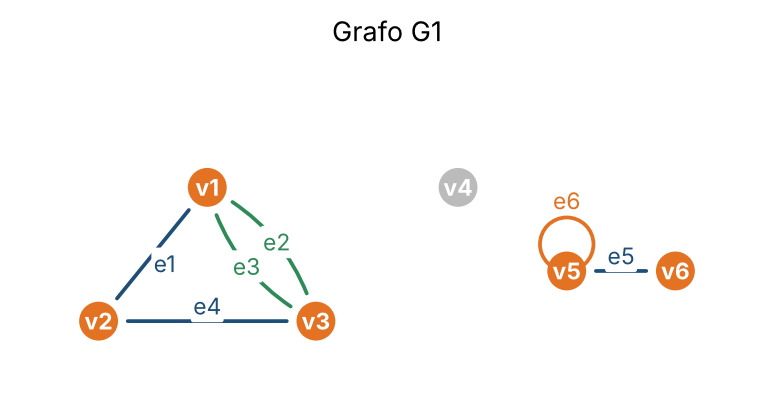
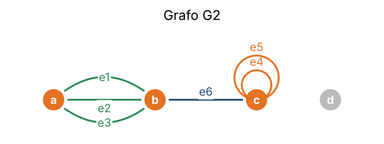
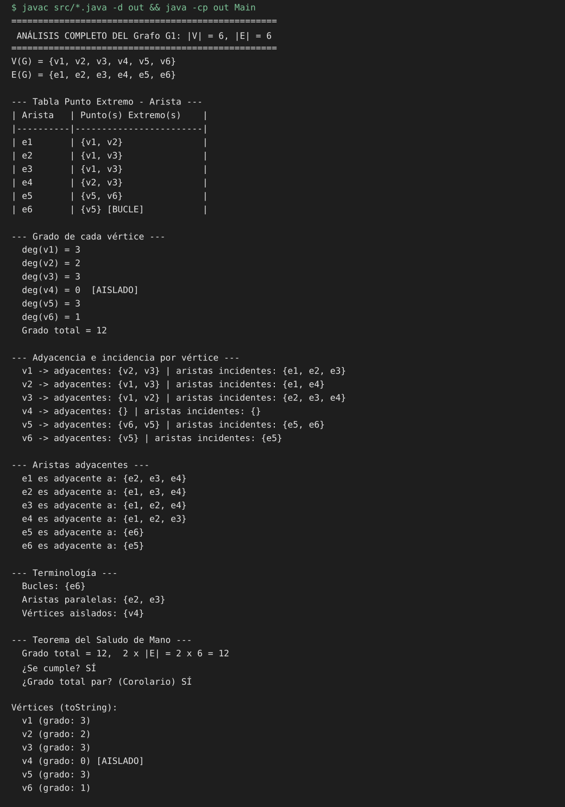

# P2A3 · Grafos no dirigidos

**Materia:** Estructuras de Datos y Algoritmos — Parcial 2
**Alumno:** Amir Moisés Hernández Farah
**Universidad Anáhuac Mayab** · Periodo 202660
**Lenguaje:** Java

---

## Objetivo

Programa que modela un **grafo no dirigido** y realiza el análisis completo de sus propiedades:

1. Crear grafos con vértices y aristas (incluyendo **bucles** y **aristas paralelas**).
2. Generar la **tabla de función punto extremo-arista**.
3. Identificar la **terminología**: adyacencia, incidencia, bucles, aristas paralelas y vértices aislados.
4. Calcular el **grado** de cada vértice (los bucles cuentan doble).

## Estructura

```
P2A3 Grafos no dirigidos/
├── src/
│   ├── Vertice.java    # nombre, id, grado, esAislado
│   ├── Arista.java     # extremos, esBucle, esParalela(), incideEn()
│   ├── Grafo.java      # V(G), E(G), grados, terminología, teoremas, reportes
│   └── Main.java       # dos grafos de prueba + puedeExistirGrafo()
├── imagenes/           # dibujos de los grafos y captura de la ejecución
├── salida.txt          # salida completa del programa
└── README.md
```

## Clases

| Clase | Responsabilidad |
|-------|-----------------|
| `Vertice` | Guarda nombre, id, grado y si es aislado. `toString()` → `v1 (grado: 3)` / `v4 (grado: 0) [AISLADO]` |
| `Arista` | Une dos vértices. Detecta automáticamente si es bucle; `esParalela(otra)` e `incideEn(v)` |
| `Grafo` | Agrega vértices/aristas, calcula grados, obtiene adyacentes, incidentes, bucles, paralelas y aislados; verifica el teorema del saludo de mano |

**Regla del grado:** si la arista es un bucle en `v` suma **2**; si no es bucle pero incide en `v` suma **1**.

## Grafos de prueba

### Grafo G1



| Arista | Punto(s) extremo(s) |
|--------|---------------------|
| e1 | {v1, v2} |
| e2 | {v1, v3} |
| e3 | {v1, v3} |
| e4 | {v2, v3} |
| e5 | {v5, v6} |
| e6 | {v5} — bucle |

| Vértice | v1 | v2 | v3 | v4 | v5 | v6 |
|---------|----|----|----|----|----|----|
| Grado   | 3  | 2  | 3  | 0  | 3  | 1  |

- **Bucles:** e6
- **Aristas paralelas:** {e2, e3}
- **Vértice aislado:** v4
- **Saludo de mano:** 12 = 2 × 6 ✔

### Grafo G2



- **Bucles:** e4, e5 (los dos en `c`, por eso deg(c) = 5)
- **Aristas paralelas:** {e1, e2}, {e1, e3}, {e2, e3}, {e4, e5}
- **Vértice aislado:** d
- **Saludo de mano:** 12 = 2 × 6 ✔

### ¿Puede existir un grafo con estos grados?

Como se permiten bucles y aristas paralelas, basta con que la **suma de grados sea par** (corolario del teorema del saludo de mano).

| Grados | Suma | ¿Existe? |
|--------|------|----------|
| [3, 3, 2, 2] | 10 | Sí |
| [1, 1, 3] | 5 | No |
| [2, 2, 2] | 6 | Sí |
| [4, 1, 1, 0] | 6 | Sí |
| [1, 2, 3, 4] | 10 | Sí |

## Ejecución

```bash
cd "P2A3 Grafos no dirigidos"
javac -encoding UTF-8 -d out src/*.java
java -cp out Main
```



La salida completa está en [`salida.txt`](salida.txt).
